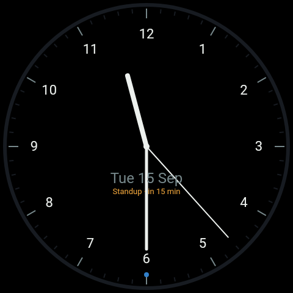
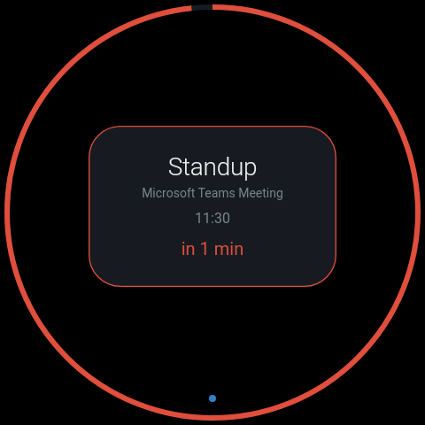
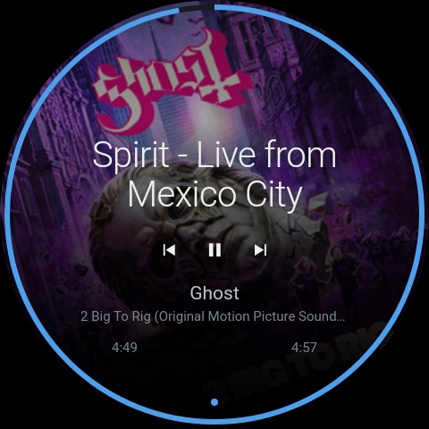
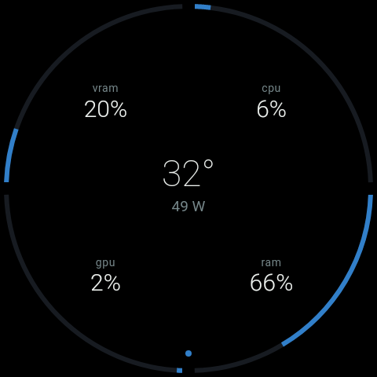
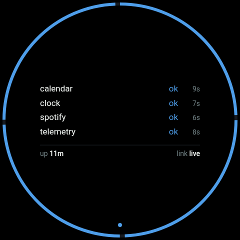
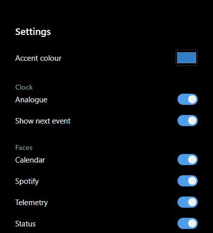

# spotdash

[](agent/go.mod)
[](LICENSE)

Inspired by [this $4 thrift-store Echo Spot rebuild](https://www.reddit.com/r/amazonecho/comments/1wen63x/i_turned_a_4_thrift_store_echo_spot_that_i_found/),
I picked up my own first-gen Amazon Echo Spot, put LineageOS on it, and
turned it into a desk dashboard. A Windows tray agent
collects machine telemetry, Spotify, and calendar data, serves a circular
480x480 web UI over the LAN, and pushes updates over a WebSocket. The Spot
just runs a kiosk WebView pointed at it.

All the logic lives in the agent. The Spot is just a panel.

## Faces

One face at a time, tap either half to switch.

<table>
<tr>
<td align="center" width="33%">
<br>
Clock
</td>
<td align="center" width="33%">
<br>
Calendar
</td>
<td align="center" width="33%">
<br>
Spotify
</td>
</tr>
<tr>
<td align="center" width="33%">
<br>
Telemetry
</td>
<td align="center" width="33%">
<br>
Status (debug)
</td>
<td width="33%"></td>
</tr>
</table>

The clock can be digital or analogue and show the next calendar event or
not, independently. That plus per-face show/hide lives on a settings page
(tray icon: Options):

<p align="left">

</p>

## Layout

| Path     | What it is                                                   |
| -------- | ------------------------------------------------------------- |
| `agent/` | Go tray app. HTTP server, WebSocket, pluggable data sources.  |
| `shell/` | Kotlin Android app. One Activity, fullscreen WebView.          |
| `docs/`  | Architecture notes and a verification log.                    |

## Hardware

Built for a 2017 Echo Spot (`rook`) on LineageOS 18.1, 480x480 circular
screen, about 1 GB RAM. You don't need one to hack on this though: the UI
runs in a browser and the shell runs in a 480x480 emulator.

## Getting it running

| Tool                | For                        |
| -------------------- | --------------------------- |
| Go 1.26+             | the agent                   |
| JDK 17+, Android SDK | the shell                   |
| mingw-w64 gcc        | `go test -race` only        |

```powershell
cd agent
go run ./cmd/spotdash
```

With no config the agent makes one: `%APPDATA%\spotdash\config.json`, with a
random token, the same defaults as `config.example.json`, and the panel opens
in your browser. It looks for a config in this order and uses the first it
finds: `-config <path>`, `config.json` next to the executable, `config.json`
in the working directory, then that per-user file. The log and the Spotify
state file live next to whichever it used. `spotdash.exe -config-path` prints
which one that is without creating anything. An existing config is never
replaced, even a broken one: fix it, or point `-config` somewhere else.

The example also has `calendar` and `spotify` blocks, switched off with
placeholder values. Fill one in and set `"enabled": true` to use it (see
"Spotify and calendar" below). The agent reads `config.json` when it starts,
and again on **Reload config** in the tray or when the settings page is
saved. Any other edit needs one of those, or a restart.

Open `http://localhost:8765/?token=<your token>`. The agent won't start with
an empty or placeholder token in `config.json` (which is gitignored, keep it
that way).

For the shell, spin up the matching emulator and install the app:

```powershell
cd shell\tools
.\avd.ps1

cd ..
.\gradlew assembleDebug
adb install -r app\build\outputs\apk\debug\app-debug.apk
adb shell am start -n dev.spotdash.shell/.PanelActivity
```

Long-press the display for 3 seconds to enter the agent URL and token
(from the emulator that's `http://10.0.2.2:8765`). The same screen has a
Wi-Fi button that opens Android's own Wi-Fi settings, for a device that
moves network. That's the only UI the shell has: there is no other input on
the real device.

Want to work on faces without running the agent at all? Open
`agent/web/dev.html` directly, it's got a toolbar for switching faces and
faking state.

## Spotify and calendar

Both sources have a `mock` mode for testing and a real mode:

- Spotify: `mode: "api"`, needs a Spotify app (Client ID only, PKCE, no
  secret) and a redirect URI of `http://127.0.0.1:8765/spotify/callback`.
  Then visit `/spotify/connect` to authorise. There is no shared app to use:
  Spotify limits an app like this to five users, so everyone creates their
  own. See [`docs/spotify-setup.md`](docs/spotify-setup.md) for the steps.
- Calendar: `mode: "ics"`, just a published ICS feed URL (Outlook: Share
  calendar > Publish). Keep the link private, anyone with it can read your
  calendar.

Full config keys and setup steps are in `docs/architecture.md`.

## Setting up the Echo Spot

With the agent running, the Spot flashed (see `docs/device.md`) and connected by USB with USB debugging on, one command does the rest:

```powershell
powershell -ExecutionPolicy Bypass -File tools\provision.ps1
```

It installs the shell APK, hands the shell the agent address and token, makes the shell the home app, sets the timezone from this PC, sets brightness, adds a Windows Firewall rule for the agent port that only the Spot can use, and checks that the panel loads. Each step prints `[PASS]`, `[SKIP]` or `[FAIL]` and the run stops at the first failure with what to do next. Running it again is safe. It needs adb (Android platform-tools) on `PATH`, a Spot that allows `adb root`, and an elevated PowerShell for the firewall step (add `-SkipFirewall` to leave that step out). The token is never printed. A transcript goes to `provision-<time>.log` next to the script. `Get-Help .\tools\provision.ps1 -Full` lists the options.

## Running it automatically

Build the everyday binary. It has no console window, which is what you want
for a tray app that starts at login:

```powershell
cd agent
.\tools\build.ps1
```

Run `agent\spotdash.exe` and tick **Start with Windows** in its tray menu.
That adds one value to your own login list (no admin rights), and unticking
removes it. It won't let you tick it for a copy running from a temp folder,
such as `go run`, since that won't exist at next login. To remove it by
hand:

```bat
reg delete HKCU\Software\Microsoft\Windows\CurrentVersion\Run /v spotdash /f
```

There is no console, so everything goes to `spotdash.log` next to
`config.json`, including why it failed to start. **View log** in the tray
menu opens it. A second copy exits quietly with a line in that log.
Relative paths in `config.json` (such as Spotify's `state_file`) mean next
to `config.json`, wherever it was started from.

Prefer a scheduled task (restart on failure, a 15 second delay after logon)?
`.\tools\autostart.ps1 -Install` registers one instead (`-Status` and
`-Uninstall` do what you'd expect). It is not a service: a service has no
desktop session to put a tray on. Use one or the other. Running both is
safe, and the second copy just exits.

## Releases

Tag a version (`git tag v0.1.0 && git push --tags`) and CI cross-compiles
`spotdash.exe` and attaches it to a GitHub Release, no local Go toolchain
needed to just run it. The zip has `spotdash.exe` (no console window, version
taken from the tag), `config.example.json`, `tools\autostart.ps1` and the
licence. Unzip it and run `spotdash.exe`: on first run it creates its own
config with a generated token (see "Getting it running") and opens the panel.
`config.example.json` is there as a reference for the settings. A tag with a
hyphen, such as `v0.2.0-rc1`, is marked as a pre-release.

The release also carries a signed shell APK, `spotdash-shell-<tag>.apk`, and the
zip has a copy under `shell\` for the provision command. Signing is described
in [`docs/signing.md`](docs/signing.md).

The exe is not code signed: this is a one-person desk toy and a signing
certificate is not worth the cost. SmartScreen will flag it as an unrecognised
publisher on first run ("More info", then "Run anyway"); that's expected.

## Security

Shared bearer token over plain HTTP on a trusted LAN, no TLS. That's a
known, accepted tradeoff for a desk toy on a home network. See
`docs/architecture.md` for the reasoning.

## More docs

- [`docs/architecture.md`](docs/architecture.md) - how it's put together, and the full source config reference.
- [`docs/verify.md`](docs/verify.md) - how each piece was tested.
- [`docs/rooting.md`](docs/rooting.md) - getting a stock Echo Spot onto LineageOS.
- [`docs/device.md`](docs/device.md) - bringing up a real Echo Spot.
- [`CONTRIBUTING.md`](CONTRIBUTING.md) - house style for commits, pull requests, issues, comments and docs.
